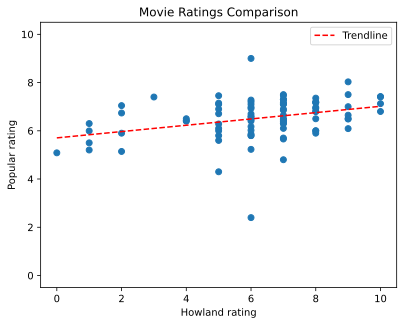

# data_analysis

This document contains observations, possible clues, and conclusions drawn from data relating to the mystery

## Results

### Compared to popular opinion

The following scatter plot compares Mr. Howland's ratings to the popular ratings from TMDB. The X-axis is Howland's rating, while the Y-axis is the popular rating. The dashed red line represents a line of best fit between the two.

<p align="center">
    
</p>

If you want more features, running `graph_gen.py` on your local machine will generate the graph and show you the interactive version. This will let you hover over the points to see each movie name, ratings, and genres. In the future I might make some sort of interactive website display, but for now this is what I've got.

### Humphrey Bogart ratings

With an RBQL query on `howland_ratings.csv`, we can see that Mr. Howland has never posted a rating for a Humphrey Bogart movie. This is likely to prevent students from narrowing down possible movie options.

Here is the query in question, if you're interested. Remember to check the "input table has header" option:

```sql
SELECT a1 JOIN hb_movies.csv on a1 == b1
```
